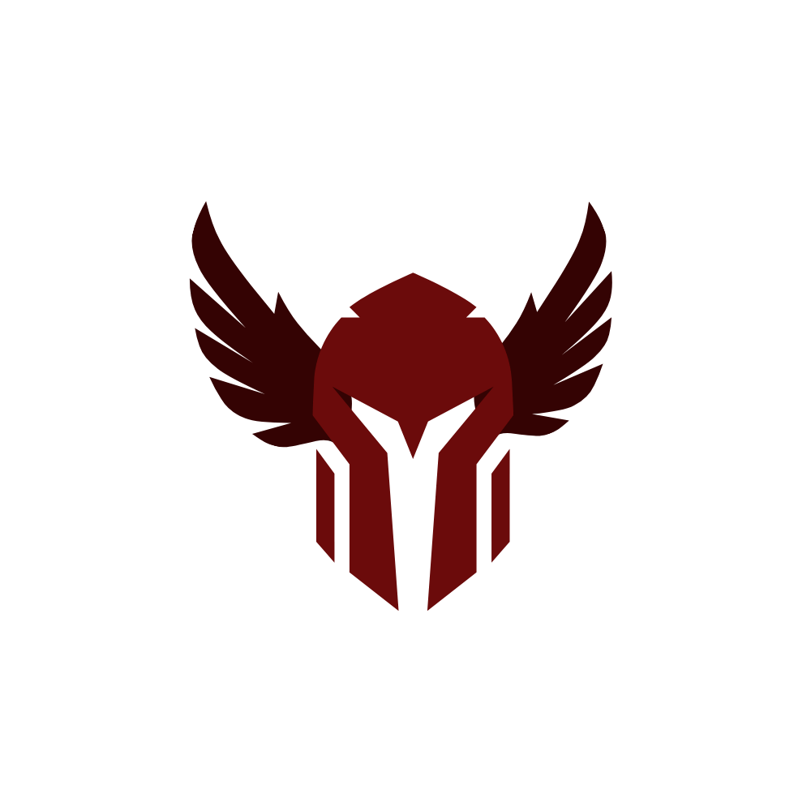

<div align="center">



**Paladin**

*Desktop market analytics and LLM-backed signal generation, in pure Rust.*

[](https://www.rust-lang.org/)
[](#license)

</div>

---

## Overview

Paladin is a proprietary trading intelligence app by **Red Rook, LLC.** The `rewrite/rust` branch replaces the original PyQt5 + LightGBM + ONNX + GPT4All stack with a pure-Rust workspace:

- `paladin` — wax-styled CLI (clap + indicatif + console + inquire + tracing).
- `paladin-gui` — native desktop shell built with `egui` / `eframe`.
- An OpenAI-compatible HTTP endpoint handles every ML/LLM concern; no local models, no Python runtime.

## Workspace layout

```text
Cargo.toml                   # workspace manifest
crates/
  paladin-core/              # candle types, indicators, features, config, paths
  paladin-data/              # yahoo_finance_api client + on-disk cache
  paladin-ai/                # OpenAI-compatible client (chat, streaming, JSON-mode signals)
  paladin-cli/               # binary: paladin
  paladin-gui/               # binary: paladin-gui (egui)
assets/                      # icon + embedded prompt context
PALADIN/                     # legacy Python tree (reference only)
```

## Build

Requires a recent Rust toolchain (1.80+).

```bash
cargo build --release
./target/release/paladin --help
./target/release/paladin-gui
```

## Configure

Configuration lives at `~/.paladin/config.toml`. The CLI creates it on first `config set`, and environment variables override any field:

| Variable | Purpose |
|---|---|
| `PALADIN_OPENAI_BASE_URL` | OpenAI-compatible base URL (default `https://api.openai.com/v1`) |
| `PALADIN_OPENAI_API_KEY` or `OPENAI_API_KEY` | API key |
| `PALADIN_MODEL` | Model name (default `gpt-4o-mini`) |
| `PALADIN_HOME` | Override data dir (default `~/.paladin`) |

```bash
paladin config set api_base_url https://api.openai.com/v1
paladin config set model gpt-4o-mini
paladin config set api_key sk-...
paladin config show
```

## CLI

```text
paladin gui                          launch desktop app
paladin signal SPY --interval 1d     fetch data + compute features + ask LLM
paladin signal SPY --json            emit raw JSON signal
paladin chart SPY                    terminal sparkline + indicator summary
paladin chat --symbol SPY            streaming chat REPL
paladin data fetch SPY               warm the local cache
paladin data clear                   clear the cache
paladin config {show|path|set k v}   view/edit config
paladin doctor                       check API + market data connectivity
paladin completions [zsh|bash|fish]  generate shell completions
paladin update --self                self-update (stub)
```

Global flags: `-v/--verbose` (DEBUG logging to `~/.paladin/logs/paladin.log`), `-y/--yes`.

## GUI

`paladin-gui` (or `paladin gui`) opens a four-tab shell:

- **Chart** — symbol + interval picker, candlestick plot via `egui_plot`, entry / stop / target overlays from the last signal.
- **Signal** — triggers an inference, renders phases as colored cards.
- **Chat** — streaming REPL.
- **Settings** — edits the same TOML as `paladin config`.

## Data & ML

- Market data: `yahoo_finance_api` (pure Rust, no `yfinance`). Cached as JSON under `~/.paladin/cache/`.
- Indicators: EMA / SMA / RSI / MACD / ATR / Bollinger / ADX, implemented natively in `paladin-core::indicators`.
- Signals: features serialized to JSON, sent with a strict schema prompt to `chat/completions` (JSON response format). The parsed `TradeSignal` mirrors the original Python `TradeSignal` dataclass.
- Chat: streaming SSE via `reqwest::bytes_stream()`.

## Regulatory Notice

> Paladin outputs analytics only. It is not investment advice, a solicitation, or a recommendation to buy or sell any security. Past performance does not guarantee future results. Operators must ensure compliance with applicable law and internal policy. Red Rook, LLC disclaims liability for trading losses.

## License

© 2026 **Red Rook, LLC.** All rights reserved.
